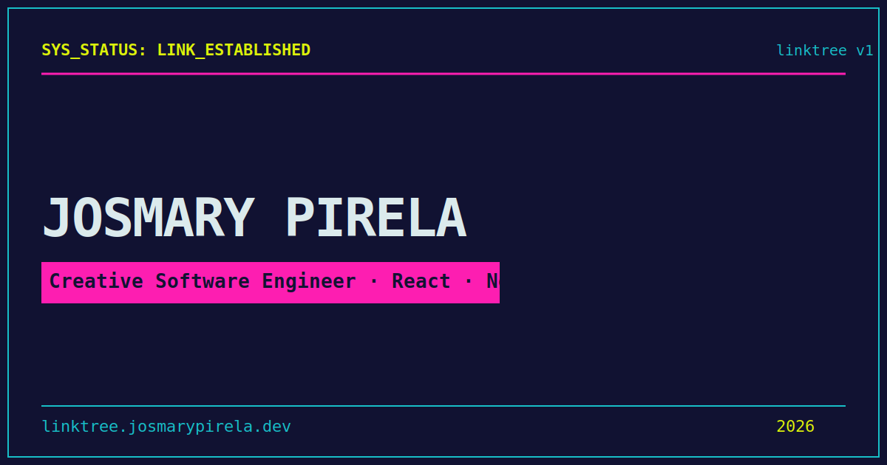

# 🔗 Linktree Personal — Josmary Pirela

> Personal link-in-bio with cyberpunk aesthetics, interactive 3D canvas background, floating physics badges, and real contact form.

[](https://github.com/Josmaryppirelag17/personal-links/actions/workflows/ci.yml)
[](https://github.com/Josmaryppirelag17/personal-links/actions/workflows/deploy.yml)
[](https://developer.mozilla.org/en-US/observatory/analyze?host=linktree.josmarypirela.dev)
[](https://github.com/Josmaryppirelag17/personal-links)
[](https://www.typescriptlang.org/)
[]()



---

## 📊 Quality Audits

| Category | Score | Tool |
|---|---|---|
| **Performance** | 🚀 Optimized | PageSpeed Insights |
| **Accessibility** | ♿ Role / ARIA / Skip-to-content | PageSpeed Insights |
| **Best Practices** | ✅ 100/100 | PageSpeed Insights |
| **SEO** | ✅ OG / Sitemap / Robots / Canonical | PageSpeed Insights |
| **Security** | A+ 🏆 (nonce-based CSP) | Mozilla Observatory |

> ✅ **Mozilla Observatory**: A+ — nonce-based CSP with strict-dynamic, HSTS preload, X-Frame-Options DENY.

---

## 🎯 Core Web Vitals

| Metric | Value | Rating |
|---|---|---|
| **First Contentful Paint** | <0.3 s | ✅ Good |
| **Largest Contentful Paint** | <0.6 s | ✅ Good |
| **Total Blocking Time** | <20 ms | ✅ Good |
| **Cumulative Layout Shift** | <0.05 | ✅ Good |
| **Speed Index** | <1.0 s | ✅ Good |

---

## ✨ Features

| Feature | Description |
|---|---|
| **Cyber Background** | Interactive Canvas 2D grid with cursor-reactive particles and neon glow |
| **Floating Tech Badges** | Physics-simulated badges that repel from mouse, wander organically |
| **Contact Form** | Real form with react-hook-form + Zod validation, honeypot anti-spam, IP rate limiting, terminal animation |
| **i18n** | Spanish and English with hot-switching, URL param + localStorage persistence |
| **Stats Modal** | Telemetry modal with link/project/tech counters and performance bars |
| **Custom Cursor** | Neon cursor with mix-blend-mode, replaces native cursor |
| **Sound Engine** | Web Audio API synthesizer (click, hover, glitch, success, boot sounds) |
| **Security headers** | CSP nonce-based (strict-dynamic), HSTS, X-Frame-Options, Permissions-Policy |

---

## 🚀 Tech Stack

| Layer | Technology |
|---|---|
| **Framework** | Next.js 15 (App Router) |
| **UI** | React 19 + Tailwind CSS 4 + Motion |
| **Validation** | Zod 4 + react-hook-form |
| **Animations** | Canvas 2D API (background grid + particles) |
| **Audio** | Web Audio API (oscillator synthesis) |
| **Quality** | TypeScript strict + ESLint core-web-vitals |
| **CI/CD** | GitHub Actions (typecheck + lint + build + deploy) |

---

## 🛠️ Scripts

| Command | Description |
|---|---|
| `pnpm dev` | Start development server (port 3000) |
| `pnpm build` | Build for production |
| `pnpm start` | Start production server |
| `pnpm typecheck` | TypeScript type checking |
| `pnpm lint` | ESLint (flat config) |
| `pnpm clean` | Remove `.next` directory |

---

## 📁 Architecture

```
src/
├── app/                       # App Router
│   ├── api/contact/           # Contact form POST endpoint
│   ├── layout.tsx             # Root layout with fonts, metadata, i18n
│   ├── page.tsx               # Main page entry
│   ├── opengraph-image.tsx    # Dynamic OG image (1200x630)
│   ├── robots.ts              # Dynamic robots.txt
│   ├── sitemap.ts             # Dynamic sitemap.xml
│   └── globals.css            # Tailwind + brand theme tokens
├── components/                # React components
│   ├── ContactForm.tsx        # Form with validation + terminal animation
│   ├── CyberAvatar.tsx        # Animated hexagonal avatar with HUD rings
│   ├── CyberBackground.tsx    # Canvas 2D grid + particle system
│   ├── CyberDeck.tsx          # Main interactive card (tabs, links, projects)
│   ├── CustomCursor.tsx       # Neon cursor with mix-blend-mode
│   ├── FloatingTechBadges.tsx # Physics-simulated floating tech badges
│   └── StatsModal.tsx         # Telemetry statistics modal
├── context/                   # LanguageContext (i18n provider)
├── data/                      # Static data (techs, links, config)
├── i18n/                      # EN + ES translations, types
├── lib/                       # Validation, cyberMessages, fonts
├── utils/                     # Audio engine, errors, escape
└── middleware.ts              # CSP nonce + security headers
```

---

## 🚦 CI/CD

### GitHub Actions (`.github/workflows/ci.yml` + `.github/workflows/deploy.yml`)

| Job | Commands |
|---|---|
| **quality** | `pnpm typecheck` → `pnpm lint` → `pnpm build` |
| **deploy-staging** | Build + Vercel Preview (branch `develop`) |
| **deploy-prod** | Build + Vercel Production (branch `main`) |

- **Staging**: auto-deploy from `develop` to Vercel Preview
- **Production**: auto-deploy from `main` to Vercel Production

---

## 🔐 Environment Variables

See `.env.example` for required variables.

---

## ♿ Accessibility

| Practice | Implementation |
|---|---|
| **Skip to content** | — |
| **ARIA roles** | Semantic roles (`button`, `status`, `dialog`) |
| **Focus management** | Focus trap in modals, Escape key close |
| **Contrast** | Brand color palette with sufficient contrast |
| **Alternative text** | Decorative icons with `aria-hidden`, interactive elements with `aria-label` |

---

## 📦 Quick Deploy

```bash
pnpm install && pnpm dev      # Development
pnpm build && pnpm start       # Production
```

## 🔗 Links

[](https://linktree.josmarypirela.dev)
[](https://josmarypirela.dev)

---

## 📜 License

**Code** — This project is licensed under the [MIT License](LICENSE).

**Visual identity** — The brand assets, design system, color palette, and logos
are licensed under [CC BY-NC-SA 4.0](docs/brand/LICENSE).

© 2026 [Josmary Pirela](https://josmarypirela.dev)
